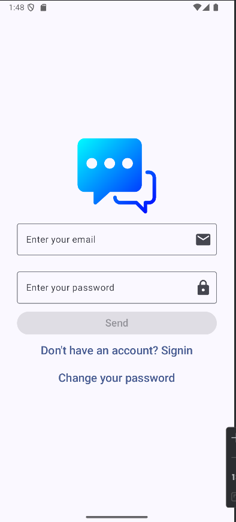
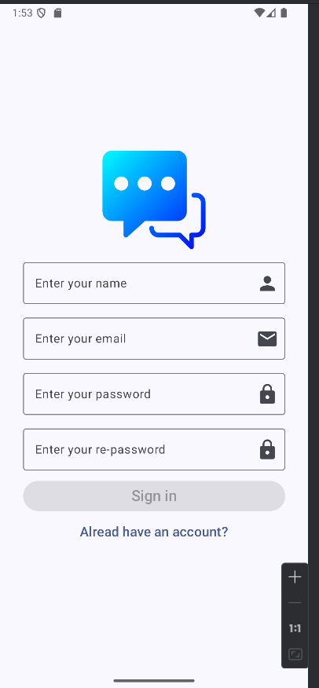
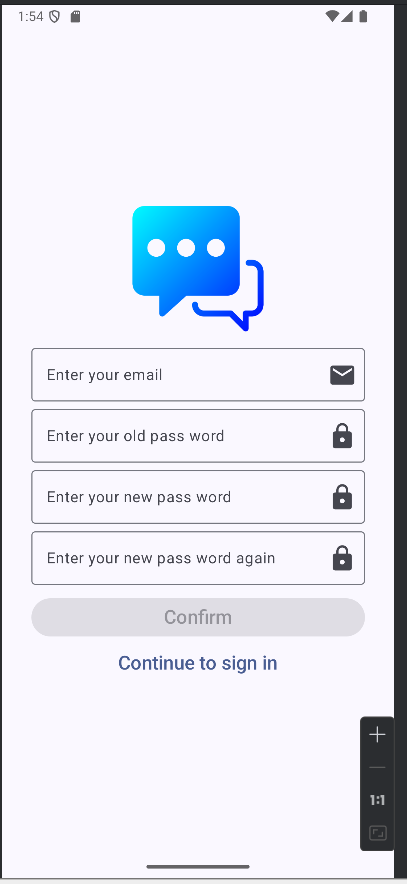
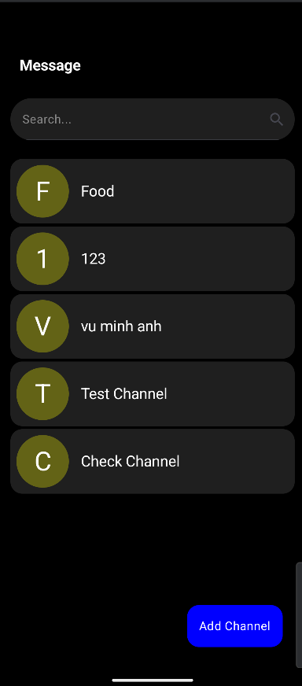
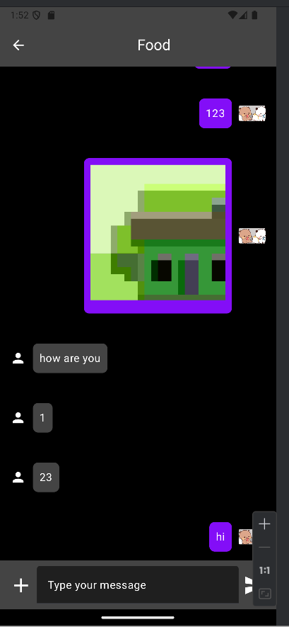
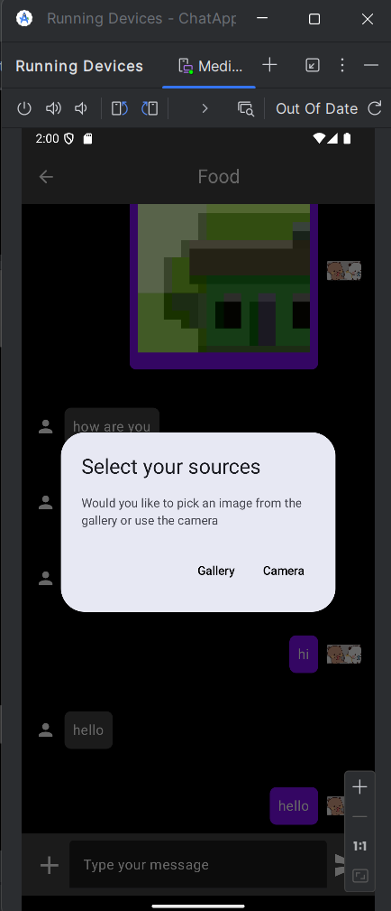
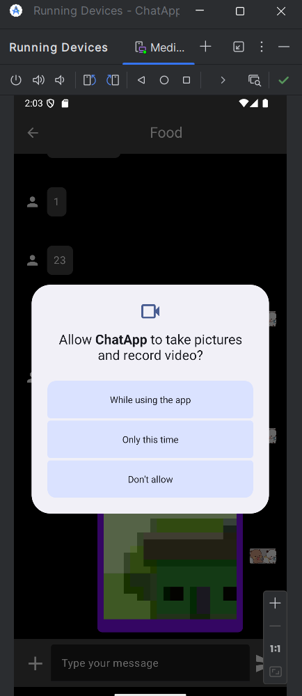
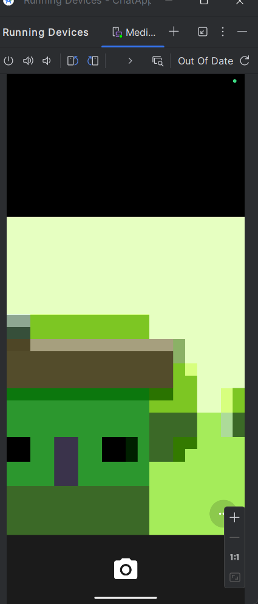
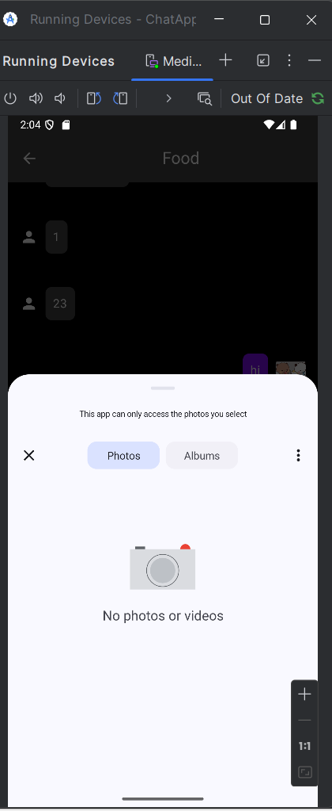

# 📱 ChatApp - Real-time Chat Application using Jetpack Compose

**ChatApp** is a real-time messaging application developed using **Jetpack Compose** and **Kotlin**. This project was built as a hands-on learning experience to strengthen my Android development skills and demonstrate my understanding of modern Android architectures and Firebase integration. It follows the **MVVM** architectural pattern and uses multiple **Firebase services** to provide real-time communication and media sharing features.

---

## 🚀 Features

- 🔐 User **authentication** using **Firebase Authentication** (email & password)
- 💬 **Real-time messaging** via **Firebase Realtime Database**
- 🖼️ **Send images** (camera or gallery) using **Firebase Storage**
- 🎨 UI built entirely with **Jetpack Compose**

---
## 🚀 ScreenShots
### Authentication (Sign-in, Sign-up, Change-password)

### Real-time messaging (Message-Channels, Chat-Screen)

### Send images (uploading and retrieving image files)

---

## 🧱 Architecture & Technologies

### 🔧 Tech Stack

- **Language**: Kotlin
- **UI Toolkit**: Jetpack Compose
- **Architecture**: MVVM (Model - View - ViewModel)
- **Asynchronous Programming**: Kotlin Coroutines
- **Dependency Injection**: Hilt

### ☁️ Firebase Services

- **Firebase Authentication** – for secure user sign-in/sign-up
- **Firebase Realtime Database** – for storing and syncing messages in real time
- **Firebase Storage** – for uploading and retrieving image files

